# TechFlow Solutions Website Structure

```mermaid
graph TD
    A[🏠 Home<br/>index.html] --> B[ℹ️ About<br/>about.html]
    A --> C[🛠️ Services<br/>services.html]
    A --> D[💼 Portfolio<br/>portfolio.html]
    A --> E[📞 Contact<br/>contact.html]
    A --> F[❓ Enquiry<br/>enquiry.html]

    C --> G[💻 Custom Software<br/>#custom-software]
    C --> H[📱 Mobile Apps<br/>#mobile-apps]
    C --> I[👥 IT Consulting<br/>#it-consulting]
    C --> J[🌐 Web Development<br/>#web-development]
    C --> K[☁️ Cloud Solutions<br/>#cloud-solutions]
    C --> L[🔒 Cybersecurity<br/>#cybersecurity]
    C --> M[📊 Data Analytics<br/>#data-analytics]
    C --> N[🎨 UI/UX Design<br/>#ui-ux-design]

    style A fill:#e1f5fe
    style C fill:#f3e5f5
    style D fill:#e8f5e8
    style E fill:#fff3e0
    style F fill:#fce4ec
```

## Current Website Structure Analysis

### Main Pages:
- **Home** (`index.html`) - Landing page with hero banner and services overview
- **About** (`about.html`) - Company information and team details
- **Services** (`services.html`) - Detailed service offerings with pricing
- **Portfolio** (`portfolio.html`) - Showcase of completed projects
- **Contact** (`contact.html`) - Contact information and location
- **Enquiry** (`enquiry.html`) - Service inquiry form

### Service Categories:
1. **Custom Software Development** - Tailored software solutions
2. **Mobile App Solutions** - iOS and Android applications
3. **IT Consulting** - Strategic technology guidance
4. **Web Development** - Modern responsive websites
5. **Cloud Solutions** - Scalable cloud infrastructure
6. **Cybersecurity** - Security assessments and protection
7. **Data Analytics** - Business intelligence and insights
8. **UI/UX Design** - User experience and interface design

### Navigation Flow:
- All main pages are accessible from the primary navigation
- Services page contains detailed sections for each service category
- Each service has pricing tiers (Starter/Professional/Enterprise)
- Contact and enquiry forms for lead generation

### Recommendations for Improvement:

1. **Add breadcrumbs** for better navigation context
2. **Implement search functionality** across services
3. **Add testimonials/case studies** section
4. **Create blog/resources** section for thought leadership
5. **Add FAQ section** to address common questions
6. **Implement chat/support widget** for immediate assistance

